# Executive summary

## Tools used

- SonarQube  was used to find the code smells, but was not implemented. Usage was for learning purposes only.
- For creating class diagram and sequence diagrams, a slightly altered version of PySequenceReverse was used.

## Manual analysis done:

- To identify the code smells and S.O.L.I.D principles violations we have manually analyzed the code. Particularly, we have analyzed the API endpoints, database code and remainder service code.

## Team member responsibilies:

Zayed Al Tamimi:

- Writing the analysis report
- Creating the class diagram and sequence diagrams
- Identifying a design violation
- Identifying a code smell
- Reflecting on the incorporation of feature 6

Sami Akouk:

- Writing the analysis report
- Reviewing the class diagram
- Identifying a design violation
- Identifying a code smell
- Reflecting on the incorporation of features 6 and 7

Salem Al Shamsi:

- Writing the analysis report
- Reviewing a sequence diagram
- Identifying 3 design violations
- Identifying a code smell
- Reflecting on the incorporation of feature 6

Ibrohim Iskandarov:

- Writing the analysis report
- Reviewing a sequence diagram
- Identifying a design violation
- Identifying 3 code smells
- Reflecting on the incorporation of feature 7

# Design Diagrams (Task 1)

# Task 2: Reflection on Design Principles

We manually reviewed the codebase and found five examples where design principles are either violated or correctly applied, covering five distinct principles.

### 1. Abstraction — Violation

**File:** `app/apis/classes.py`
**Method:** `Classes.post()`
**Lines:** 52–126

**What abstraction means:**
The caller should not need to know the internal steps of a function. It should just call one method and get a result. All the complexity should be hidden inside a service.

**What we found:**
The `post()` method that creates a class does everything itself. There is no service hiding the complexity. The three screenshots below show the three parts of this method:

**Screenshot 1** — Role check and reading input from the request (lines 52–61):
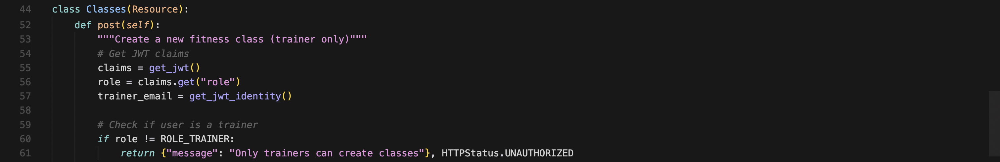

**Screenshot 2** — Validating the input data (lines 63–94):
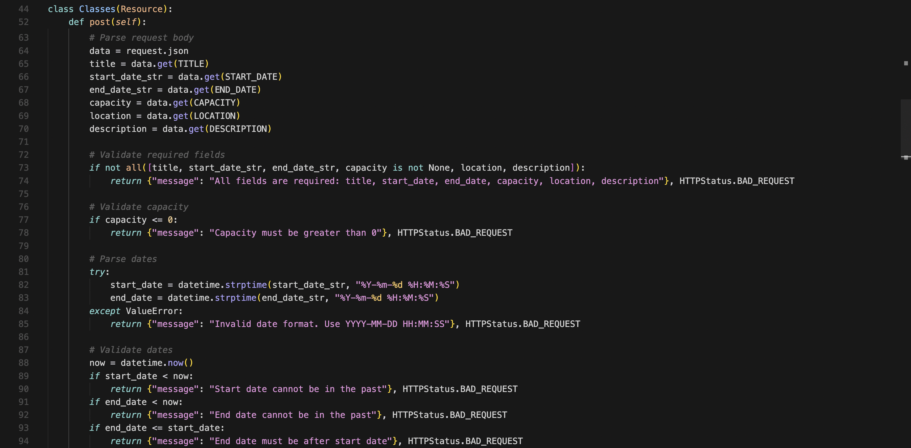

**Screenshot 3** — Looking up the trainer in the database and creating the class (lines 96–126):
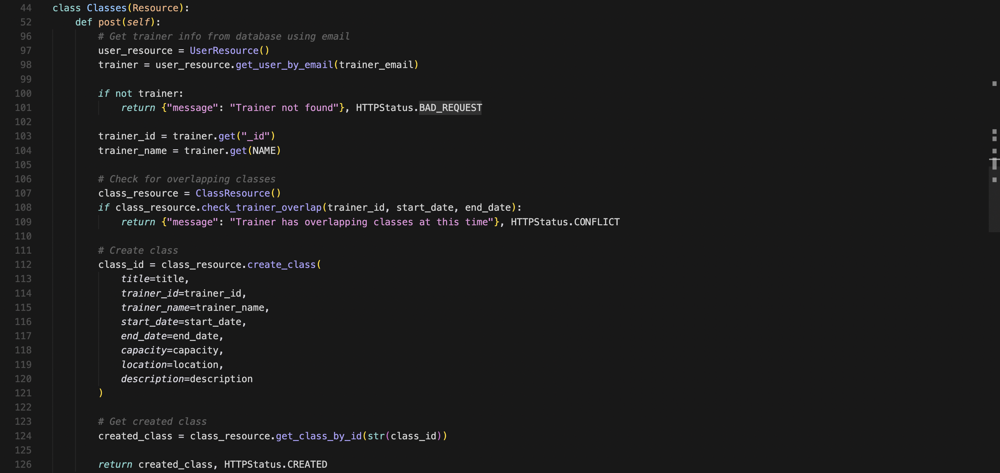

**Why this is a problem:**
As seen in Screenshots 1, 2, and 3, the endpoint method itself handles all of these steps: checking the user's role, reading and parsing the request body, validating all input fields, parsing and checking dates, looking up the trainer in the database, checking for scheduling conflicts, and creating the class. That is seven different things in one method.

Now compare that to the reminder endpoint in the same file (lines 256–260):

```python
reminder_service = ReminderService(SESEmailService(Config.SES_SENDER_EMAIL))
return reminder_service.send_reminder(class_id, trainer_id)
```

That is two lines. Everything happens inside `ReminderService` and the endpoint does not need to know how. The create-class endpoint does not have an equivalent service, so it violates abstraction.

### 2. Encapsulation — Violation

**File:** `app/apis/classes.py`
**Method:** `Classes.get()`
**Lines:** 158–167

**What encapsulation means:**
Internal data should stay private inside its class. Other parts of the code should interact through methods, not by directly touching internal fields or data structures.

**What we found:**
The `get()` method that returns upcoming classes directly reads field names from the raw database response inside the API layer. Screenshot 4 shows this:

**Screenshot 4** — API directly accessing raw database fields (lines 144–170):
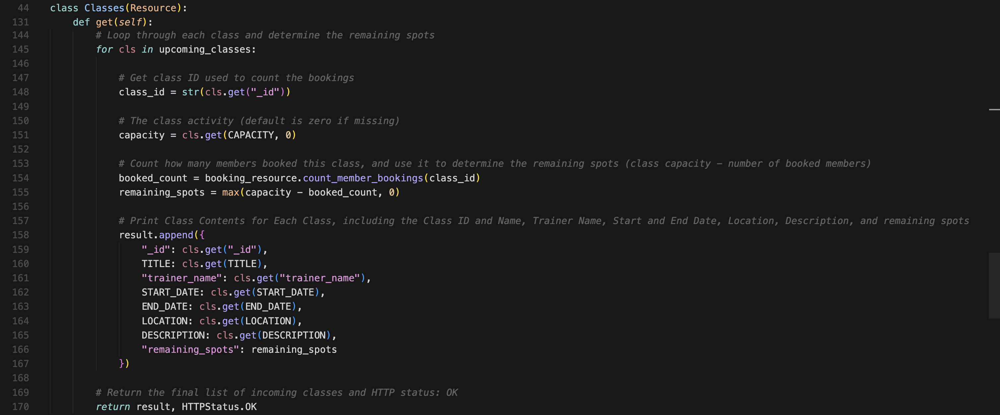

**Why this is a problem:**
As seen in Screenshot 4, the API uses strings like `"_id"` and `"trainer_name"` to access data directly:

```python
result.append({
    "_id": cls.get("_id"),
    "trainer_name": cls.get("trainer_name"),
    ...
})
```

The API now knows how data is stored inside the database. If we ever rename `"trainer_name"` to `"instructor_name"` in the database, every file that uses that string will break. The fix would be to have `ClassResource` provide a method that formats the response internally, so the API never needs to know the field names.

### 3. Modularity — Violation (Low Cohesion)

**File:** `app/apis/classes.py`
**Lines:** 1–261 (entire file)

**What modularity means:**
A file should do one clear thing. Everything in it should belong together. This is called high cohesion. If a file does many unrelated things, it has low cohesion.

**What we found:**
This one file contains three completely different resources. Screenshots 5, 6, and 7 show each one:

**Screenshot 5** — First resource: `Classes` (creates and views classes, line 44):


**Screenshot 6** — Second resource: `ClassMembers` (views who booked a class, line 175):


**Screenshot 7** — Third resource: `ClassReminder` with imports placed in the middle of the file (lines 228–235):


**Why this is a problem:**
As seen across Screenshots 5, 6, and 7, `Classes` handles creating and viewing classes, `ClassMembers` handles viewing who booked a class, and `ClassReminder` handles sending reminder emails which has nothing to do with the other two. Also in Screenshot 7, the imports for `ReminderService` and `SESEmailService` appear in the middle of the file at lines 229–230 instead of at the top where all imports should go. This shows `ClassReminder` was added later without restructuring the file. The fix would be to split this into three separate files, one per resource.

### 4. Single Responsibility Principle — Violation

**File:** `app/apis/auth.py`
**Method:** `Register.post()`
**Lines:** 35–73

**What SRP means:**
A method should have one job and one reason to change. If you need to update a method because the validation rules changed, AND because the database changed, AND because the token format changed — it has too many responsibilities.

**What we found:**
The `Register.post()` method does many different things at once. Screenshots 8 and 9 show the two halves:

**Screenshot 8** — Input reading, a debug log, and validation (lines 35–56):


**Screenshot 9** — Creating the user, generating a token, and returning the response (lines 57–73):
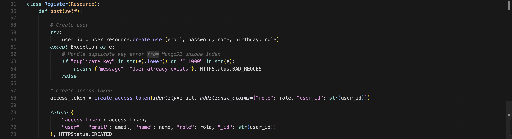

**Why this is a problem:**
As seen in Screenshots 8 and 9, this one method is responsible for reading input from the request, validating required fields and the role value, checking if the user already exists in the database, creating the user, handling MongoDB-specific errors, generating a JWT token, and building the response. Screenshot 8 also shows a `print()` debug statement left in production code on line 44, which does not belong here. This method has at least five different reasons to change, which directly violates SRP.

### 5. Open/Closed Principle — Good Example

**Files:** `app/services/email_service.py` (Lines: 1–4, Method: `send_email`) and `app/services/ses_email_service.py` (Lines: 1–24, Method: `send_email`)

**What OCP means:**
A class should be open for extension (you can add new behavior) but closed for modification (you do not touch existing working code). You do this by creating a base class that others can extend.

**What we found:**
The email service design correctly follows this principle. Screenshots 10 and 11 show the two files:

**Screenshot 10** — The base class `EmailService` (email_service.py):
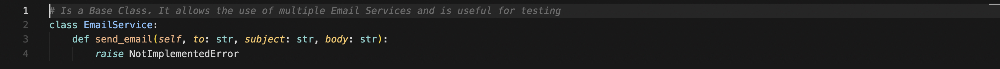

**Screenshot 11** — The concrete implementation `SESEmailService` (ses_email_service.py):
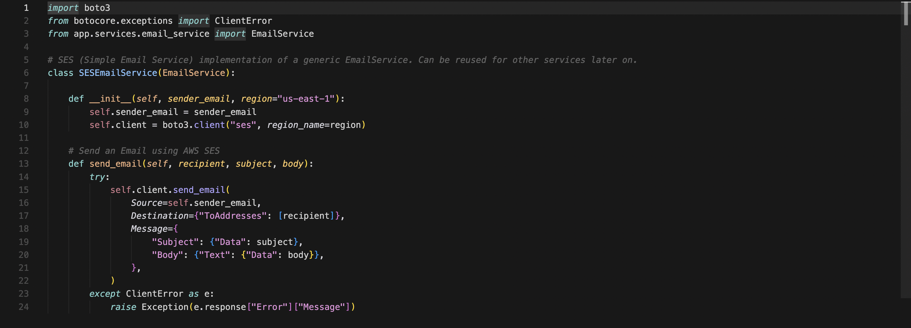

**Why this is correct:**
As seen in Screenshot 10, `EmailService` just defines what `send_email` should look like. It never needs to change. Screenshot 11 shows `SESEmailService` implementing it for AWS without touching the base class.

When Sprint 3B adds Telegram or SMS notifications (Feature 7), the team can simply write:

```python
class TelegramService(EmailService):
    def send_email(self, recipient, subject, body):
        # send via Telegram
```

No existing code needs to be modified. `ReminderService` will work with the new class automatically because it depends on `EmailService` in general, not on `SESEmailService` specifically.

# Code smells (Task 3)

1. long method: post in [app/apis/classes.py](../app/apis/classes.py#L52) is a long method because it handles auth, validation, parsing, overlap checks, persistence, and response formatting in one block.  
  image: 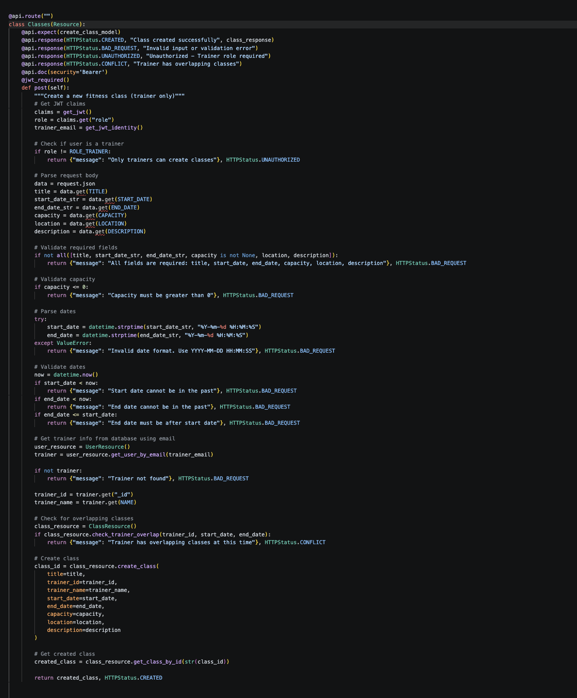

2. dead code: jwt = jwtmanager(app) in [app/__init__.py](../app/__init__.py#L19) is created but never used after assignment.
  image: 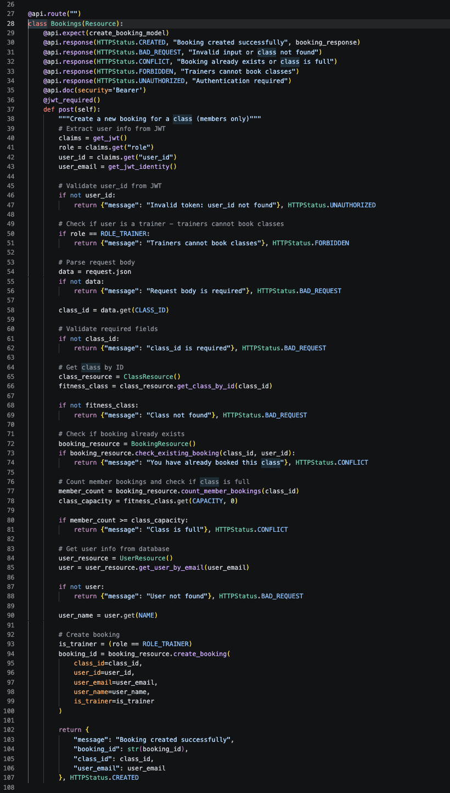

3. primitive obsession: date and time are parsed as raw strings [app/apis/classes.py](../app/apis/classes.py#L82). Better to take the DateRange into separate class with its own methods (overlap checking, past validation) and attributes (start time, end time).
  image: 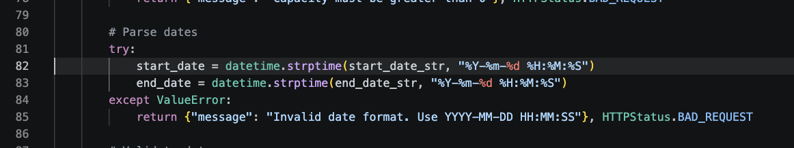

4. long parameter list: create_class in [app/db/classes.py](../app/db/classes.py#L26) has a long parameter list because it takes 8 inputs: title, trainer_id, trainer_name, start_date, end_date, capacity, location, and description.  
  image: 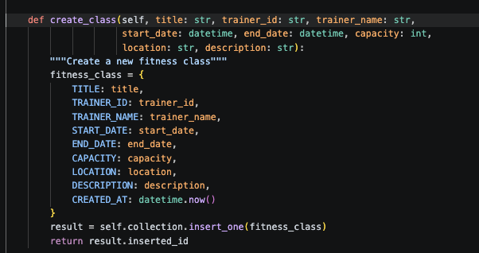

5. duplicate code: getting jwt claims all repeat the same pattern in different places.
- a. [app/apis/classes.py](../app/apis/classes.py#L54)
- b. [app/apis/classes.py](../app/apis/classes.py#L184)
- c. [app/apis/booking.py](../app/apis/booking.py#L39)


  images: 
  1. 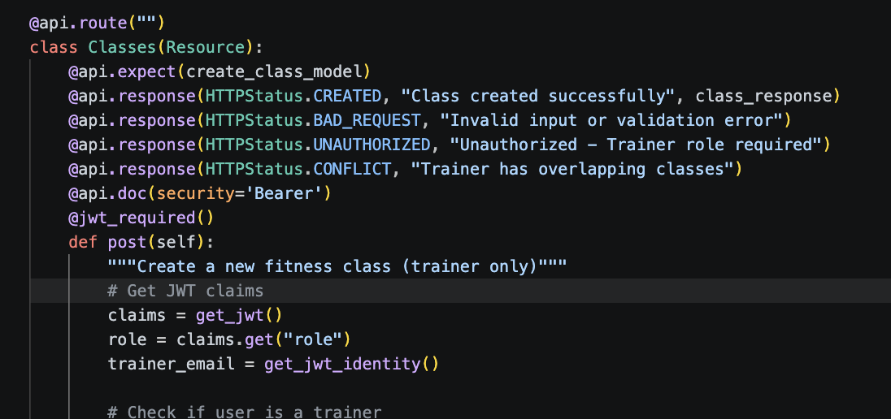
  2. 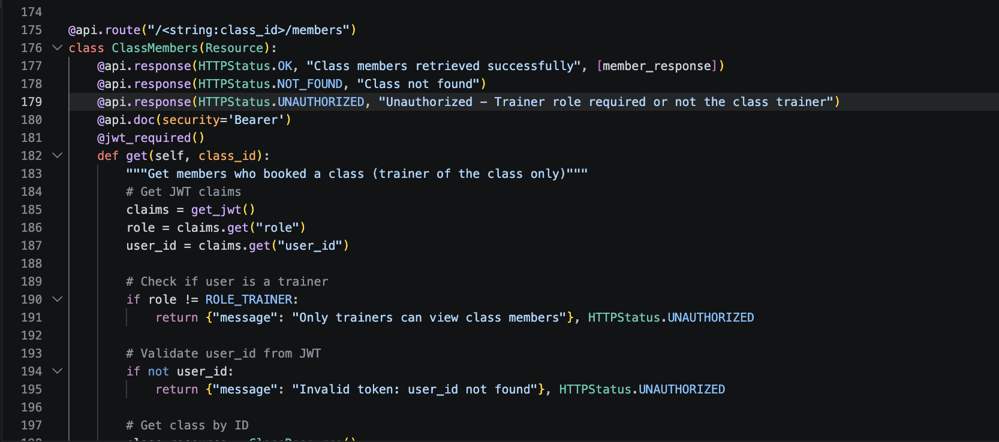
  3. [!code_smell_5c.png](images/code_smell_5c.png)

# Task 4: Sprint 3B Feature Reflection

## How the current design affects Feature 6 and Feature 7

The current design is likely to hinder the implementation of Feature 6 (Create Recurring Class) and Feature 7 (Configure Notifications), especially from maintainability and extensibility perspectives.

- `app/apis/classes.py` contains a long, multi-responsibility `Classes.post()` flow that mixes auth, request parsing, validation, scheduling conflict checks, persistence, and response formatting. This makes adding recurring class logic harder and increases the risk of bugs.
- Date and time are handled as raw strings rather than a reusable date/schedule domain model. Recurring classes need a cleaner abstraction for recurrence rules, date ranges, and overlap logic.
- `Classes.get()` and similar API code access raw database fields directly, which reduces encapsulation. This will make schema changes or the addition of recurrence metadata more difficult.
- The same file has low cohesion, combining class creation, membership listing, and reminder sending. Adding new notification preferences or recurring-class endpoints in this module will worsen maintainability.
- Duplicate JWT claim extraction in `app/apis/classes.py` and `app/apis/booking.py` shows missing shared auth handling. This increases boilerplate when adding new protected endpoints for notification configuration or recurring class management.

## Specific impacts on Feature 6: Create Recurring Class

- The long `post()` method means the recurring class logic would need to be bolted onto an already complex path.
- Primitive date parsing makes it difficult to express and validate recurrence patterns like daily or monthly classes.
- The database layer uses long parameter lists and raw field access, which means recurring schedule metadata would likely be spread across several places rather than encapsulated.

## Specific impacts on Feature 7: Configure Notifications

- The existing notification handling is currently limited to email, but the `EmailService` / `SESEmailService` pattern is a good foundation.
- The system lacks a user preference or notification-settings model, so implementing channel selection (email/Telegram/SMS) would require new abstractions and likely refactoring of the reminder flow.
- Low modularity in the API layer means new notification endpoints would be added into already crowded files instead of isolated resources.

## Existing design flaws that make new features harder

1. `Classes.post()` is too long and violates abstraction/SRP.
2. Date/time handling is primitive and not encapsulated.
3. JWT claim extraction is duplicated across endpoints.
4. `app/apis/classes.py` has low cohesion and mixes unrelated resources.
5. Raw DB field access in the API layer breaks encapsulation.

## Conclusion

The current design contains enough maintanability issues that Feature 6 and Feature 7 will be more difficult to implement cleanly without refactoring. The team should prioritize extracting class creation and scheduling logic into services, introducing a reusable recurrence/date model, centralizing auth handling, and separating API resources before adding these new features.
