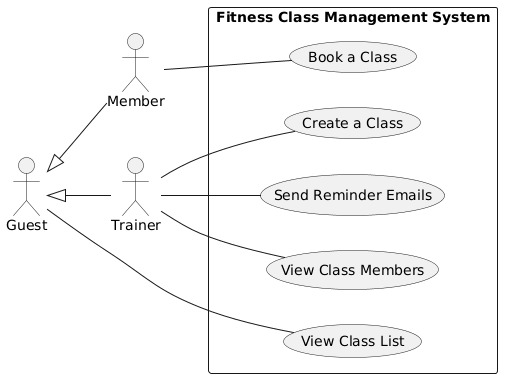

# Fitness Class Management System

## Requirements Elicitation and Analysis

**Date of Client Meeting:** February 12, 2026  

**Elicitation Techniques Used:**  
- Direct questioning of the client regarding user roles, permissions, and workflows.  
- Simple booking flows to clarify overlaps and constraints.  
- Scenario-based questions to clarify system behavior (e.g., booking full classes, trainer privileges).  

**Reflection:**  
1. The combination of direct questioning and scenario sketches was very effective for understanding permissions and constraints, particularly around overlapping classes and trainer privileges.  
2. An important clarification gained: Guests cannot book classes, and trainers cannot book classes either (booking is restricted to members only).  
---

## Requirements Specification

## Use Case Diagram

## Actors and Their Use Cases

**Guest (Not Registered)**
- View Class List

**Member (Registered)** 
- View Class List
- Book a Class

**Trainer/Admin**
- View Class List
- Create Class
- View Members
- Send Reminder Emails

## Use Cases

### Feature 1: Create Class (Trainer/Admin)

**Primary Actor:** Trainer/Admin  
**Goal:** Allow trainer/admin to create a new fitness class.

**Preconditions:**  
- User is authenticated as trainer/admin.

**Trigger:**  
- Trainer selects the option to create a new class.

**Main Flow:**  
1. Trainer inputs the following details:  
   - Class Name/Title  
   - Start Date and End Date  
   - Capacity (must be greater than 0)  
   - Location  
   - Description/Type  
2. System validates all inputs.  
3. System checks that the trainer has no overlapping classes at the given time.  
4. Class is saved and becomes visible to all users.

**Alternative Flows:**  
- **A1 – Non-trainer attempts to create a class:** System rejects the request and informs the user that only trainers can create classes.  
- **A2 – Missing required fields:** System rejects the request and informs the user which fields are required.  
- **A3 – Capacity is zero or negative:** System rejects the request and informs the user that capacity must be greater than zero.  
- **A4 – Invalid date format:** System rejects the request and informs the user of the expected date format.  
- **A5 – Start or end date is in the past:** System rejects the request and informs the user that the date cannot be in the past.  
- **A6 – End date is before or equal to start date:** System rejects the request and informs the user that the end date must be after the start date.  
- **A7 – Trainer has an overlapping class:** System rejects the request and informs the trainer that they already have a class scheduled at that time.  

**Postconditions:**  
- Class is created and listed in the system.

**Constraints:**  
- No editing or deleting classes in Sprint 1.  
- Only one trainer per class.

---

### Feature 2: View Class List (Guests and Members)

**Primary Actor:** Guest/Member  
**Goal:** Allow users to view available classes.

**Preconditions:**  
- None for guests; members must be authenticated.

**Main Flow:**  
1. User requests the list of classes.  
2. System retrieves all classes with a start date in the future.  
3. For each class, the system calculates remaining spots (capacity minus current bookings).  
4. System returns the list showing for each class:  
   - Class ID, Title, Trainer Name  
   - Start Date and End Date  
   - Location, Description  
   - Remaining spots  

**Alternative Flows:**  
- **A1 – No upcoming classes exist:** System returns an empty list.  

**Postconditions:**  
- Users can see the list of upcoming classes and their details.

**Constraints:**  
- Viewing does not require login for guests.
- For future sprints, members will be able to view their bookings (previous and upcoming).

---

### Feature 3: Book a Class (Members Only)

**Primary Actor:** Member  
**Goal:** Book a slot in an upcoming class.

**Preconditions:**  
- Member is authenticated.  
- Class has available capacity.

**Main Flow:**  
1. Member selects a class and requests to book it.  
2. System verifies the class exists.  
3. System checks that the member has not already booked this class.  
4. System checks that the class is not full.  
5. Booking is created and a confirmation is returned to the member.

**Alternative Flows:**  
- **A1 – Trainer attempts to book:** System rejects the request and informs the user that only members can book classes.  
- **A2 – Required input is missing:** System rejects the request and informs the user that the class selection is required.  
- **A3 – Class does not exist:** System rejects the request and informs the user that the selected class was not found.  
- **A4 – Member has already booked this class:** System rejects the request and informs the member that they have already booked this class.  
- **A5 – Class is full:** System rejects the request and informs the member that there are no remaining spots.  

**Postconditions:**  
- Booking is confirmed and visible in the member's upcoming classes.

**Constraints:**  
- No waitlist in Sprint 1.  
- No priority system beyond first-come, first-served.  
- Users cannot cancel bookings in Sprint 1.

---

### Feature 4: View Members (Trainers Only)

**Primary Actor:** Trainer  
**Goal:** Allow trainer to view class roster.

**Preconditions:**  
- Trainer is authenticated.

**Main Flow:**  
1. Trainer selects a class they created.  
2. System verifies the class exists.  
3. System confirms the requesting trainer is the one assigned to the class.  
4. System returns the roster with each member's name, email, and booking time.

**Alternative Flows:**  
- **A1 – Non-trainer attempts to view members:** System rejects the request and informs the user that only trainers can view class members.  
- **A2 – Class does not exist:** System informs the trainer that the class was not found.  
- **A3 – Trainer is not assigned to this class:** System rejects the request and informs the trainer that they are not authorized to view members of this class.  
- **A4 – No members are booked in the class:** System returns an empty roster.  

**Postconditions:**  
- Trainer can see the list of members for their class.

**Constraints:**  
- Trainers can only view members for their own classes.  
- Members cannot view the roster.

---

### Feature 5: Email Reminders (Trainers Only)

**Primary Actor:** Trainer
**Secondary Actor:** Amazon Simple Email Service (SES) 
**Goal:** Allow trainer to send reminder emails to all registered members of a class.

**Preconditions:**  
- Trainer is authenticated.
- Trainer is assigned to the class.

**Trigger:**  
- Trainer selects a class and requests to send reminders.

**Main Flow:**  
1. Trainer selects a class they created.  
2. System verifies the class exists and the trainer is assigned to it.  
3. System retrieves all booked members for the class.  
4. For each member, system sends an email, through Amazon's SES, containing:  
   - Participant name  
   - Class name/title  
   - Class start and end date/time  
   - Class location  
   - Gym branding in the subject line (e.g., "NYUAD GYM Reminder: [Class Name]")  
5. Trainer receives a confirmation that reminders were sent successfully.

**Alternative Flows:**  
- **A1 – Non-trainer attempts to send reminders:** System rejects the request and informs the user that only trainers can send class reminders.  
- **A2 – Class does not exist:** System informs the trainer that the class was not found.  
- **A3 – Trainer is not assigned to this class:** System rejects the request and informs the trainer that they are not authorized to send reminders for this class.  
- **A4 – No members are booked in the class:** System informs the trainer that there are no registered members to notify.  
- **A5 - Email not validated by Amazon SES:** System informs the trainer that it couldn't locate the credentials

**Postconditions:**  
- All booked members receive a reminder email about the upcoming class.

**Constraints:**  
- Only the assigned trainer can send reminders for a class.
- Emails are sent via AWS SES; both sender and recipients must be verified if in SES sandbox mode.

---

## Non-Functional Requirements

**Security**  
- The system shall store all user passwords in a securely hashed form; plain-text passwords shall never be persisted.  
- The system shall require token-based authentication for all protected endpoints.  
- The system shall enforce role-based access control so that users can only perform actions permitted by their assigned role.  

**Usability**  
- The system shall provide interactive API documentation that allows users to explore and test all endpoints from the browser.  
- The system shall return clear, human-readable error messages for all failed requests.  

**Reliability**  
- The system shall validate all user inputs before processing, including date formats, required fields, and numeric constraints.  

**Portability**  
- The system shall expose a RESTful API that can be consumed by any HTTP-capable client.  
- The system shall separate email delivery into an independent service layer so that the email provider can be changed without modifying business logic.
